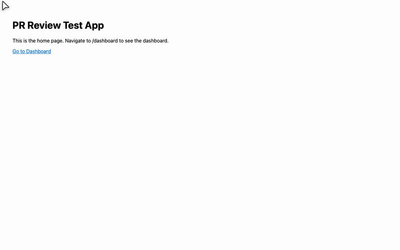
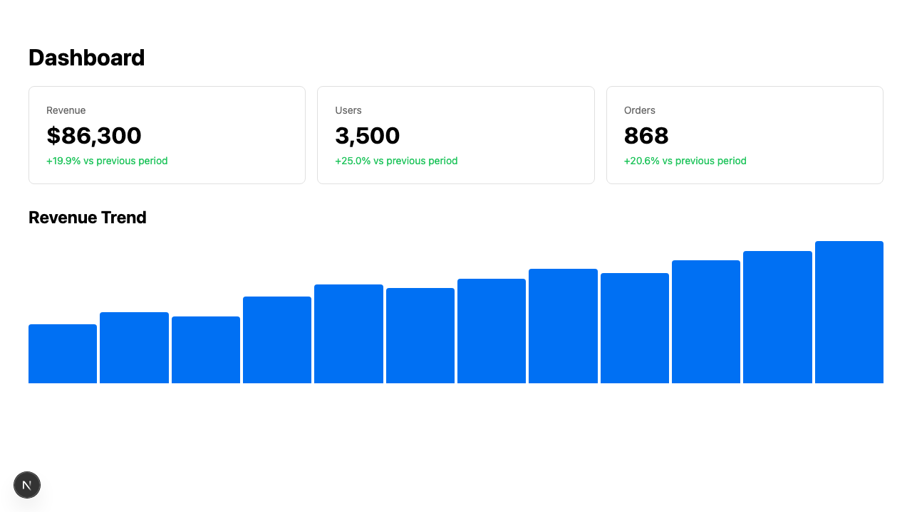

## Automated PR Review



   

> [!CAUTION]
> **6 bugs fixed in Dashboard and StatsCard components — all caused runtime crashes:**
>
> **1. `StatsCard`: Non-null assertions crash on undefined values (critical)**
> `value!.toLocaleString()` and `value!.toFixed()` throw when `value` is `undefined` (before API responds).
> ```diff
> - ? `$${value!.toLocaleString()}`
> + ? `$${value.toLocaleString()}`
> ```
> Added null-check guard clause returning a loading placeholder. [`StatsCard.tsx#L11-L30`](https://github.com/mshuffett/pr-review-test-hard/blob/eval/pr-review-test/src/components/StatsCard.tsx#L11)
>
> **2. `StatsCard`: Wrong percentage change formula (high)**
> Divides by `value` instead of `previousValue` — produces incorrect metrics.
> ```diff
> - const percentageChange = ((value! - previousValue!) / value!) * 100;
> + const percentageChange =
> +   previousValue != null && previousValue !== 0
> +     ? ((value - previousValue) / previousValue) * 100
> +     : 0;
> ```
> [`StatsCard.tsx#L39-L43`](https://github.com/mshuffett/pr-review-test-hard/blob/eval/pr-review-test/src/components/StatsCard.tsx#L39)
>
> **3. `Dashboard`: Division by -Infinity / NaN when chartData is empty (critical)**
> `Math.max(...[])` returns `-Infinity`, dividing by it produces `NaN` heights.
> ```diff
> - const maxValue = Math.max(...chartData);
> - const normalizedData = chartData.map((value) => value / maxValue);
> + const maxValue = chartData.length > 0 ? Math.max(...chartData) : 0;
> + const normalizedData =
> +   maxValue > 0 ? chartData.map((value) => value / maxValue) : chartData.map(() => 0);
> ```
> [`Dashboard.tsx#L61-L64`](https://github.com/mshuffett/pr-review-test-hard/blob/eval/pr-review-test/src/components/Dashboard.tsx#L61)
>
> **4. `Dashboard`: No loading state — renders chart with null data (high)**
> Added `loading` state with proper loading UI.
> [`Dashboard.tsx#L41-L48`](https://github.com/mshuffett/pr-review-test-hard/blob/eval/pr-review-test/src/components/Dashboard.tsx#L41)
>
> **5. `Dashboard`: No error handling for failed API fetch (high)**
> Added try/catch with error state and user-visible error message.
> [`Dashboard.tsx#L27-L35`](https://github.com/mshuffett/pr-review-test-hard/blob/eval/pr-review-test/src/components/Dashboard.tsx#L27)
>
> **6. `api-client`: `API_BASE_URL` not available in browser (critical)**
> Next.js only exposes `NEXT_PUBLIC_` prefixed env vars client-side. The dynamic import in Dashboard throws because `process.env.API_BASE_URL` is `undefined` in the browser.
> ```diff
> - const API_BASE_URL = process.env.API_BASE_URL;
> + const API_BASE_URL =
> +   process.env.NEXT_PUBLIC_API_BASE_URL ?? process.env.API_BASE_URL;
> ```
> [`api-client.ts#L1-L4`](https://github.com/mshuffett/pr-review-test-hard/blob/eval/pr-review-test/src/lib/api-client.ts#L1)

> [!WARNING]
> **No real API backend exists.** The dashboard depends on `API_BASE_URL` pointing to a real API that serves `/dashboard/stats`. A mock Next.js API route (`src/app/api/dashboard/stats/route.ts`) was added for development/testing, but this should be replaced with the actual API integration before shipping.

<details>
<summary><strong>All issues (6 total, all fixed)</strong></summary>

| Sev | Issue | Fix | Link |
|:---:|-------|-----|:----:|
| :red_circle: | `StatsCard`: `value!` non-null assertion crashes on undefined | Added null-check guard clause with loading placeholder | [`L11`](https://github.com/mshuffett/pr-review-test-hard/blob/eval/pr-review-test/src/components/StatsCard.tsx#L11) |
| :red_circle: | `Dashboard`: `Math.max(...[])` = `-Infinity`, division produces `NaN` | Guard empty arrays, default to 0 | [`L61`](https://github.com/mshuffett/pr-review-test-hard/blob/eval/pr-review-test/src/components/Dashboard.tsx#L61) |
| :red_circle: | `api-client`: env var invisible to browser (Next.js `NEXT_PUBLIC_` prefix) | Support both prefixed and unprefixed variants | [`L3`](https://github.com/mshuffett/pr-review-test-hard/blob/eval/pr-review-test/src/lib/api-client.ts#L3) |
| :orange_circle: | `StatsCard`: Wrong % change formula `(v-p)/v` should be `(v-p)/p` | Fixed formula + zero/undefined guard | [`L39`](https://github.com/mshuffett/pr-review-test-hard/blob/eval/pr-review-test/src/components/StatsCard.tsx#L39) |
| :orange_circle: | `Dashboard`: No loading state, renders chart with null data | Added loading/error states | [`L41`](https://github.com/mshuffett/pr-review-test-hard/blob/eval/pr-review-test/src/components/Dashboard.tsx#L41) |
| :orange_circle: | `Dashboard`: No error handling for API fetch failure | Added try/catch + error UI | [`L27`](https://github.com/mshuffett/pr-review-test-hard/blob/eval/pr-review-test/src/components/Dashboard.tsx#L27) |

</details>

<details>
<summary><strong>Tests (21 added, all passing)</strong></summary>

| Suite | Count | Type | Link |
|-------|:-----:|:----:|:----:|
| StatsCard unit tests | 7 | Unit | [`StatsCard.test.tsx`](https://github.com/mshuffett/pr-review-test-hard/blob/eval/pr-review-test/src/components/__tests__/StatsCard.test.tsx) |
| Dashboard unit tests | 4 | Unit | [`Dashboard.test.tsx`](https://github.com/mshuffett/pr-review-test-hard/blob/eval/pr-review-test/src/components/__tests__/Dashboard.test.tsx) |
| api-client unit tests | 4 | Unit | [`api-client.test.ts`](https://github.com/mshuffett/pr-review-test-hard/blob/eval/pr-review-test/src/lib/__tests__/api-client.test.ts) |
| Dashboard e2e tests | 6 | E2E | [`dashboard.spec.ts`](https://github.com/mshuffett/pr-review-test-hard/blob/eval/pr-review-test/e2e/dashboard.spec.ts) |

**Unit test output:**
```
 ✓ src/lib/__tests__/api-client.test.ts (4 tests) 11ms
 ✓ src/components/__tests__/StatsCard.test.tsx (7 tests) 39ms
 ✓ src/components/__tests__/Dashboard.test.tsx (4 tests) 52ms

 Test Files  3 passed (3)
      Tests  15 passed (15)
```

**Coverage (changed files):**
```
 src/components/Dashboard.tsx  | 100% Stmts | 91.66% Branch | 100% Funcs | 100% Lines
 src/components/StatsCard.tsx  | 100% Stmts | 100% Branch   | 100% Funcs | 100% Lines
 src/lib/api-client.ts         | 100% Stmts | 100% Branch   | 100% Funcs | 100% Lines
```

**E2E test output (Playwright):**
```
 ✓ home page loads and links to dashboard (693ms)
 ✓ dashboard page loads with data (811ms)
 ✓ dashboard stats cards show correct data (817ms)
 ✓ dashboard shows percentage changes (825ms)
 ✓ dashboard chart bars render (805ms)
 ✓ navigating from home to dashboard (1.5s)

 6 passed (6.2s)
```

</details>

### UI Verification

<details>
<summary><strong>Home Page</strong></summary>


</details>

<details>
<summary><strong>Dashboard — Full View</strong></summary>

<table>
<tr>
<td align="center"><strong>Dashboard loaded</strong></td>
<td align="center"><strong>Stats cards detail</strong></td>
</tr>
<tr>
<td></td>
<td></td>
</tr>
</table>

</details>

<details>
<summary><strong>Dashboard — Percentage Changes & Chart</strong></summary>

<table>
<tr>
<td align="center"><strong>Percentage changes</strong></td>
<td align="center"><strong>Revenue chart</strong></td>
</tr>
<tr>
<td></td>
<td></td>
</tr>
</table>

</details>

<details>
<summary><strong>Navigation Flow — Home to Dashboard</strong></summary>

<table>
<tr>
<td align="center"><strong>Step 1: Home page</strong></td>
<td align="center"><strong>Step 2: After click</strong></td>
</tr>
<tr>
<td></td>
<td></td>
</tr>
</table>

</details>
